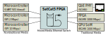
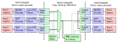
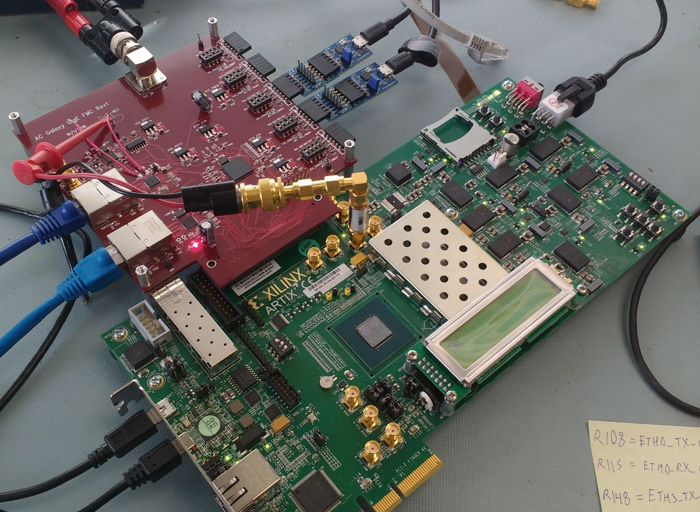
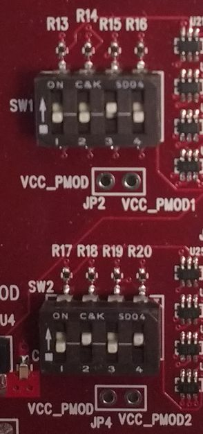
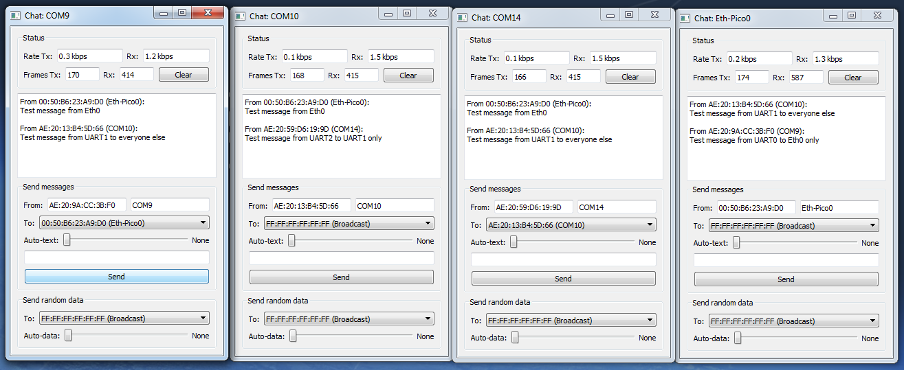

# SatCat5 Frequently Asked Questions

## General

### What is this project?

SatCat5 is a mixed-media Ethernet switch that lets a variety of devices communicate on the same network.
It also includes embedded software libraries to help microcontrollers interact with Ethernet networks.

A SatCat5 switch is roughly equivalent to a typical consumer-grade Ethernet switch,
except that it can also deliver Ethernet frames over nontraditional media like I2C, SPI, or UART.

### What is Ethernet over UART?

An [Ethernet frame](https://en.wikipedia.org/wiki/Ethernet_frame) is just a series of bytes.
You can send those bytes over any medium you like.
Ethernet frames can include higher-layer protocols like UDP and TCP/IP, but they don't have to.

On interfaces that don't already have frame-boundary indicators (like I2C, SPI, and UART),
SatCat5 uses [IETF RFC 1055](https://tools.ietf.org/html/rfc1055)
[SLIP encoding](https://en.wikipedia.org/wiki/Serial_Line_Internet_Protocol)
as a simple way to mark the start and end of each frame.
These interfaces don't require inter-packet gaps or preambles.

### Don't you mean octets?

Sure.

### Why should I use this?

Most low-power microcontrollers don't have traditional Ethernet ports,
and it's not something that can be implemented with software-controlled GPIO.
SatCat5 lets a microcontroller communicate on the same Local Area Network as a bunch of PCs,
a GPU system-on-module, or an FPGA.

We think this might be useful for Internet-of-Things applications,
but even more useful for things like small satellites and cubesats,
which typically pack many microcontroller-based subsystems into a small volume.

SatCat5 is used for the modular payload interface on [the Slingshot-1 cubesat mission](https://aerospace.org/article/slingshot-platform-showcase-advantages-modular-payload-architecture).
For more details, please refer to the [full interface specification and mission-operations report](../examples/slingshot).

### Can I customize it?

Yes! That's a big part of why we chose the CERN Open Hardware License,
so you can use our VHDL building blocks to link together a custom SatCat5 switch for your application.
We anticipate most users will need some degree of tailoring, so we've tried to make it as easy as we can.

We have chosen the "weakly reciprocal" variant of the OHL (CERN-OHL-W v2 or later).
If you make improvements to SatCat5, you may be obligated to share them.
Please refer to the [full text of the license](../LICENSE.txt) for details.

### Why CERN-OHL-W?

Earlier versions of SatCat5 were released under an [LGPLv3 license](https://www.gnu.org/licenses/lgpl-3.0.en.html#license-text).
You may continue to use those versions under those terms.

However, some users found it difficult to use LGPLv3 because its
legal terms are ambiguous or difficult to apply to FPGA designs.
Such concerns are [echoed by OSHWA](https://www.oshwa.org/best-practices-for-sharing-fpga-designs-2/),
which now recommends CERN-OHL licenses for open hardware and gateware.

Moving forward, we chose [CERN-OHL-W v2 or later](https:/cern.ch/cern-ohl)
for the same reason we chose LGPL. They are very similar in strategic intent.

### Can I help?

Yes! We welcome outside contributions including bug reports and code changes.
Please check [the guide here](CONTRIBUTING.md) for more information.

### What about power consumption?

Most Ethernet switches require several watts to operate.
SatCat5 uses a small fraction of that.

An I2C/SPI/UART network switch can be run for less than 100 mW.

Even a multi-port gigabit network switch can be run for less than 700 mW in MAC-to-MAC mode.

### What is MAC-to-MAC mode?

The biggest power hog in a regular Ethernet network isn't the switch logic; it's the transceivers.
You need one on each end of every 1000BASE-T link, together they draw about 1W per port.
They need that power to cross building-scale distances up to 100m, but not everyone needs that.

Instead, we can leverage the various
[Media-Independent Interfaces](https://en.wikipedia.org/wiki/Media-independent_interface)
that have become de-facto standards.
These are typically used to allow a device (the MAC) to communicate with
a specialized physical-layer transceiver (the PHY).

In most networks, each end of a link has a MAC and a PHY, with a long cable in between:

    MAC - PHY - ...long cable... - PHY - MAC

But most MAC-to-PHY links are roughly symmetric; in most cases you can attach them back-to-back:

    MAC - ...short cable... - MAC

The MAC-to-MAC signals aren't suitable to travel long distances, but that's not a problem for a 30cm long cubesat.

### What if I want regular Ethernet ports?

SatCat5 supports that too.
Just attach a suitable PHY chip, and signal transformers if needed.
Take a look at the [example design](../test/proto_pcb).

We include an [MDIO interface](../src/vhdl/common/io_mdio_readwrite.vhd)
if the PHY needs configuration.  We also include I2C, SPI, and UART interfaces.
These configuration interfaces are operated using [ConfigBus](CONFIGBUS.md),
commands from ROM or an attached microcontroller.
[Multi-platform C++ software drivers](SOFTWARE.md) are provided for each I/O interface.

## FPGAs

### What FPGAs are supported?

Currently we support several FPGA platforms:

* Lattice iCE40
* Microsemi PolarFire
* Xilinx 7-series FPGAs (Artix7, Kintex7, Virtex7, Zynq-7000)
* Xilinx Ultrascale and Ultrascale+ FPGAs

We hope to add support for other FPGA platforms [soon](CHANGELOG.md).

### How big an FPGA do I need?

Resource needs scale more-or-less linearly with the number of ports.
The limiting resource is usually block-RAM.
Low-speed ports don't need as much block-RAM as gigabit ports.

The full-size example design (four gigabit ports and four low-speed ports)
could fit on an XC7A50T with room to spare.
The minimalist design with only low-speed ports could easily fit on an XC7A15T.

### How do I build the example designs?

A variety of example designs [are provided here](../examples).

Each sub-folder includes a TCL script that will create any required project files
and automatically execute the build using Libero, Vivado, or Yosys.
You must have the appropriate vendor tool installed or provide a suitable [Docker image](DEVOPS.md).

Most of these scripts are linked to "make" targets specified in the SatCat5 root folder.

Scripts for Xilinx Vivado have been tested with Vivado 2015.4, 2016.3, and 2019.1, but they should work as-is with most other versions.
Scripts that use Xilinx SDK, such as "arty_managed", require version 2016.3 or above.

As an example, consider the [basic example Digilient Arty A7](../examples/arty_a7).

If you're running Linux, just run "make arty_35t" in the root folder.

If not, launch Vivado and run the following commands:

    cd \[your SatCat5 download folder\]
    set argv 35t
    source examples/arty_a7/create_project_arty_a7.tcl

### What about automated build environments?

Internally, we use Jenkins to perform automated builds and unit-tests for every new version.
This allows a rapid [Continuous Integration / Continuous Deployment build cycle](DEVOPS.md).

The provided Jenkins script will not function outside our company LAN,
but can serve as a template for your own automated build systems.

## Network Features

### What is the switch topology?

The switch_core logic is a shared-medium, output queued switch.
This architecture was chosen mainly for simplicity;
it is well-suited to smaller networks with many low-rate ports and up to a dozen gigabit ports.
Beyond that scale, a more complex crossbar or shared-memory topology is typically required.

### What switch features are supported?

The core of SatCat5 is a Layer-2 Ethernet switch.
The switch can be built in managed or unmanaged configurations.
Managed switches are configured using the [ConfigBus interface](CONFIGBUS.md).

The switch directs packets based on destination MAC address.
The MAC-address(es) associated with each port are learned automatically
by inspecting the source MAC address of each frame.
Packets with an unrecognized destination are treated as broadcast packets.

The switch supports broadcast packets (destination MAC FF:FF:FF:FF:FF:FF)
and will send such packets to every port except the original ingress port.

[Internet Group Management Protocol (IGMP)](https://en.wikipedia.org/wiki/Internet_Group_Management_Protocol)
has rudimentary support.
The switch does not track group membership on an address-by-address basis,
but will limit multicast traffic to ports that are IGMP-aware.

[Virtual local-area networks (VLAN / IEEE 802.1Q)](https://en.wikipedia.org/wiki/IEEE_802.1Q)
are supported for network segmentation and prioritization.
Per-VID throughput allocation may be added in a future release.

[Precision time protocol (PTP / IEEE 1588-2008)](https://en.wikipedia.org/wiki/Precision_Time_Protocol)
is supported.  If enabled, a SatCat5 switch acts as an "End-to-end Transparent Clock"
as described in IEEE 1588-2019 Section 10.2a.  A software-based PTP client is also
provided.  SatCat5 uses VERDACT technology to allow sub-nanosecond accuracy.

[Spanning Tree Protocol](https://en.wikipedia.org/wiki/Spanning_Tree_Protocol)
is not supported. It is up to the user to ensure no loops are present in the network.

[Simple Network Management Protocol (SNMP)](https://en.wikipedia.org/wiki/Simple_Network_Management_Protocol)
is not supported. We may add a simpler management protocol in a future release.
(e.g., So that a network device can activate or deactivate certain high-speed ports to save power.)

[Time-Triggered Ethernet](https://en.wikipedia.org/wiki/TTEthernet) is not currently supported.

[Cut-through switching](https://en.wikipedia.org/wiki/Cut-through_switching)
for latency reduction is not supported.
Due to extreme disparities in line-rates, this would be difficult to integrate.

Packet prioritization is optionally supported.
Packets can receive elevated priority based on EtherType and/or VLAN priority tags.

Many of these features are optional and can be disabled to save FPGA resources.

### How are MAC addresses assigned to network devices?

For now, we're leaving that up to each developer.
Functionally, the most important requirement is to ensure that each address on the local network is unique.
For typical applications, there is no need to register for an OUI;
randomly assigned addresses from the Locally Administered Address pool have an
infinitesimal chance of accidental collision.

A simple method is to take [six random bytes](https://www.random.org/cgi-bin/randbyte?nbytes=6&format=h)
and set the [U/L bit](https://en.wikipedia.org/wiki/MAC_address#Universal_vs._local) to one.
If there will never be more than one instance of a given device type on a network,
then that random address can simply be hard-coded.

### How are each device's MAC addresses associated with specific ports?

By default, the switch is self-learning:
it monitors source and destination MAC addresses to determine where to send future packets.
To save FPGA resources, MAC tables are typically limited to a fixed maximum number
of addresses for the entire network (typically ~64 unique addresses).

### How big can the network be?

The MAC-learning and MAC-lookup system is resource-intensive.
The example designs are limited to a maximum network size of 64 devices.
This can be increased at the cost of additional FPGA resources.

### Why is the example design segmented into two parts?

Each instance of the "switch_core" block is a network segment, with different rules and settings.

The low-speed segment services all I2C, SPI, and UART ports.
It is always powered on and ready to receive frames.
It has an 8-bit datapath and relatively small buffer sizes.
This segment allows runt frames (see below).

The high-speed segment services all gigabit Ethernet ports.
It can be shut down to save power.
It has a 24-bit datapath and larger buffer sizes, to better accommodate bursty traffic.
Since any port could be another gigabit Ethernet switch,
it has a full MAC-lookup engine so that any port can have any number of MAC addresses (up to a preset total).
We've tested designs with datapaths up to 48-bits wide.

The port_crosslink block bridges the two, performing any required conversions.
Datapath widths in all cases are set such that the individual port is the only relevant throughput limit.

### What frame sizes are accepted?

All network segments support normal frames (i.e., 64-1522 bytes).

If configured, any segment can also accept jumbo frames (up to 9022 bytes).
Using jumbo frames increases the required buffer sizes (see discussion below).

If configured, low-speed segment(s) can also accept runt frames (as few as 18 bytes).
In some cases, this can save a lot of wasted time on UART ports.

### What happens if network segments have different capabilities?

As they cross to a segment with different rules,
runt frames have their payload zero-padded to the new minimum length.
To support this change, the EtherType field must not be used as a length parameter.
The new FCS will automatically be recalculated.

Jumbo frames are simply dropped if they cross to a segment that doesn't support them.
This is usually the desired behavior,
since jumbo traffic usually isn't intended or well-suited for low-speed network nodes.

### What happened to all the old MAC-address lookup algorithms?

Previous versions of SatCat5 included a variety of algorithms for looking up ports based on MAC-address.
However, in practice the LUTRAM implementation matched or outperformed all others in terms of complexity,
network scalability, resource utilization, thoughput, and latency.
The new general-purpose TCAM block is based on this algorithm, and supports improved caching.

Rather than upgrading every implementation to support higher throughput,
we opted to focus our efforts on one algorithm only.

### How do I choose the switch_core datapath width?

To avoid bottlenecks, the datapath of a given network segment should
be wide enough to accept the sum of worst-case traffic for all ports
on that segment, not including internal crosslinks.

For example, the low-speed segment in the example design has four ports,
each running at a maximum of 10 Mbps, for a total of 40 Mbps.
Its datapath is 8-bits wide running at 25 MHz, for a total of 200 Mbps.
Since 40 << 200, this is adequate, and the extra margin allows smaller
buffer sizes (see below).

For example, the high-speed segment in the example design has four ports,
each running at a maximum of 1000 Mbps, for a total of 4000 Mbps.
Its datapath is 24-bits wide running at 200 MHz, for a total of 4800 Mbps.
Since 4000 < 4800, this is adequate.
However, the reduced margin means that a larger input buffer is required.

### How do I choose input buffer sizes?

Input queues are small, they are used only for clock-domain-crossing and packet verification.

The absolute minimum input buffer size is 2 kiB,
enough for a full-size frame, plus the start of the next one.
This is adequate in any case where the switch_core datapath
is several times faster than the aggregate throughput,
which is generally true of segments with mostly low-speed ports.

More congested network segments should increase this limit to allow at least two full-size frames.
In other words: 4 kiB for normal frames or 20 kiB for jumbo frames.
This allows full throughput in cases where many ports simultaneously receive consecutive maximum-length frames.
There is no benefit to input buffers that are substantially larger than this threshold.

Because this switch is primarily output-queued, input buffer overflows should almost never occur.
Frequent input overflows likely indicate an inadequate switch_core datapath width (see previous question).

### How do I choose output buffer sizes?

Since this switch is output-queued, dropping frames at the output queue
is a necessary and unavoidable means of flow control.
In cases with constant and regular traffic,
frame drops at the output buffer indicate that no solution exists;
there's simply too much traffic going to a given egress port,
so some frame loss was inevitable.

However, a larger buffer can help in cases where traffic is bursty.
The buffer must be sized to accommodate the largest expected burst,
but unfortunately such statistics are highly application-specific.

In practice, we have found that an output buffer about 4x larger than the input buffer is usually adequate.
In any case, the output buffer should never be smaller than the input buffer.

### How are errors reported?

Most errors are handled in switch_core.
They are reported by a "toggle" event on the errvec_t signal;
a change in a given bit represents a specific error type.
(See switch_core.vhd for details.)
The toggle events are used to facilitate clock-domain crossing,
since most designs use multiple network segments with different clock domains.

The error_reporting block can report this in different ways.
It produces a human-readable ASCII stream which can be forwarded to a UART or an LCD screen.
You can also just blink an LED for each error. (The example design does all three!)
See switch_aux for examples.

Certain types of errors (e.g., PHY-reported errors or undecodable SGMII 8b/10b symbols)
will report the error (as above) and then reset the xMII interface to recover to a known-good state.

### Why is my SGMII link getting so many errors?

The SGMII link requires low-jitter, stable reference clocks.
We've found that the clocks provided on the AC701 development board are not adequate for this purpose.
On our prototype, we've found that providing a high-quality external clock to
the FPGA and/or the AR8031 PHY massively reduces the error rate.
Reference clocks of 100 MHz or higher also help to reduce PLL clock-jitter.

This is a topic for future development, and we hope to make improvements to improve reference jitter tolerance.

## Pi-Wire

### What is "Pi-Wire"?

Pi-Wire is software that can be loaded onto a Raspberry Pi.
It converts the Pi's conventional Ethernet port to the 4-wire format used by SatCat5.
This allows a low-cost adapter to connect a conventional Ethernet network to a SatCat5 switch or a SatCat5 device.

The name is intended to indicate that the device acts as close as possible to a wire.
Ideally, it simply allows every packet through, verbatim,
and doesn't really act like an independent device.

Refer to the [Pi-Wire README](../test/pi_wire/README.md) for additional information.

### What interfaces are supported?

The Pi-Wire can be used in 4-wire UART mode or in SPI mode.

In 4-wire UART mode,
the flow-control signals are ignored and the Pi-Wire software is always ready to accept new data.
As a result, the interface is completely symmetric,
which means that the Pi-Wire can be connected to a SatCat5 switch or to a SatCat5 device.

In SPI mode, the Raspberry Pi must act as an SPI clock source.
As a result, it can only connect to a SatCat5 switch.

## Precision Time Protocol (PTP)

### What is the Precision Time Protocol?

The Precision Time Protocol (PTP) is defined by IEEE-1588.
It is a network protocol for precise two-way time transfer and ranging,
allowing PTP clients to precisely synchronize their clocks over a network.
PTP can operate in L2 (raw-Ethernet) or L3 (UDP) mode.

PTP clients apply precise Tx and Rx timestamps to each packet.
The catch is that end-to-end network delays are affected by network congestion.
For this reason, network equipment between PTP clients must update certain
timestamp fields in PTP messages, to allow clients to accurately compensate.

### How does SatCat5 support PTP?

SatCat5 is intended to comply with IEEE-1588-2019.
All PTP features are optional.

SatCat5 switches operate in "end-to-end transparent clock" mode
as described in IEEE 1588-2019 Section 10.2a.
The switch supports both L2 and L3 modes without further configuration.

The `port_mailmap` block is a fully capable PTP endpoint.
It can apply all required transmit and receive timestamps,
operating in one-step mode (each SYNC message includes its own timestamp)
or in two-step mode (timestamp sent in a separate FOLLOW_UP message).
It also includes a PTP-compatible real-time clock controlled by the
`ptp::Client` and `ptp::TrackingController` classes.

All of the above use VERDACT to allow accurate collinear timestamps
regardless of the source and destination clock domain(s).

For more information, refer to the `vc707_ptp_client` example design.

### What is VERDACT?

Vernier-referenced digital asynchronous collinear timestamps (VERDACT).

[Our paper in IEEE Access](https://ieeexplore.ieee.org/document/10367970)
describes VERDACT theory of operation in detail, along with lab measurements of its
performance. In many cases, VERDACT timestamps have sub-picosecond collinearity.

In summary, VERDACT consists of a vernier reference (see `ptp_counter_gen.vhd`)
and a synchronized counter (see `ptp_counter_sync.vhd').
One reference can drive any number of asynchronous counters.
Each counter reports the estimated timestamp for each rising edge in a given clock domain.
All such timestamps are collinear with the same best-fit line (i.e., numeric value vs. time).

VERDACT is related to the
[DDMTD](http://white-rabbit.web.cern.ch/documents/DDMTD_for_Sub-ns_Synchronization.pdf)
system used by [White Rabbit Project](https://ohwr.org/project/white-rabbit/wikis/home).
DDMTD allows FPGAs to measure the static phase offset between syntonized
clocks with sub-picosecond accuracy.

VERDACT allows FPGAs to measure dynamic time offsets between asynchronous clocks
with sub-picosecond accuracy, eliminating the need for Synchronous Ethernet.

### How accurate is SatCat5 PTP?

VERDACT has demonstrated sub-picosecond timestamp collinearity.

The end-to-end synchronization of the PTP client has demonstrated sub-nanosecond precision.

## Reference Design: Arty

### What's the Arty reference design?

The [Arty A7](https://reference.digilentinc.com/reference/programmable-logic/arty/start)
is a low-cost FPGA development board made by Digilent.
It includes an Artix-7 FPGA, a 10/100 Ethernet port, and a number of PMOD ports.

SatCat5 includes a reference design for an Ethernet switch.
When installed on the Arty A7, it becomes a five-port SatCat5 switch
with one regular Ethernet port and four auto-sensing SPI/UART ports.

Further details specific to this design are included [here](../examples/arty_a7/README.md).

## Reference Design: Prototype V1

### What's the Prototype V1?

The Prototype V1 is a reference design that can be built using an off the shelf FPGA board,
plus a custom PCB for I/O.
The custom card uses an FMC connector (LPC or HPC),
so it should be compatible with a variety of FPGA development boards.
We provide a reference design for the [Xilinx AC701](https://www.xilinx.com/products/boards-and-kits/ek-a7-ac701-g.html).

The custom board includes the following interfaces:

* Four PMOD connectors, with 3.3V level shifters.

* An [SJA1105](https://www.nxp.com/docs/en/data-sheet/SJA1105.pdf)
automotive switch ASIC.

* One [TJA1100](https://www.nxp.com/docs/en/data-sheet/TJA1100.pdf)
special-purpose automotive transceiver, connected to the automotive switch.

* Two RJ45 jacks with, each with an
[AR8031 PHY](https://media.digikey.com/pdf/Data%20Sheets/CSR%20PDFs/AR8031_DS_(Atheros)_Rev1.0_Aug2011.pdf).
Each one has an RGMII and SGMII interface.
Both SGMII interfaces are routed to the FMC port (i.e., controlled by the FPGA).
The first RGMII is connected to the automotive switch ASIC; the other is routed to the FMC port.

### Why include the automotive switch?

Initial design concepts used a two-tiered approach in an attempt to save power.
An FPGA would handle the lower-speed (nontraditional) interfaces,
with an uplink to the ASIC, which would handle gigabit traffic.

We ultimately decided not to pursue this approach.
As a result, the software that configures and boots the SJA1105 is currently incomplete and non-functional.

### Why are there so many Xilinx projects?

Each project is an example design showing different switch capabilities,
and has a separate corresponding top-level VHDL file under /src/vhdl/xilinx.
They use progressively more FPGA resources.
Due to differences in FPGA usage and clock infrastructure, their power draw varies substantially.

The "_base" design is the simplest.
It includes several low-speed ports and an RMII uplink port that connects to the automotive switch ASIC.

The "_rgmii" design is the first that supports gigabit Ethernet.
It provides all of the above plus two RGMII ports,
one to the automotive switch ASIC and one to the second AR8031 transceiver.

The "_sgmii" design is the most capable.
It provides all of the above plus an SGMII interface to each of the two AR8031 transceivers.

### How do I use the PMOD connectors?

By default:

* PMOD1-4 is an Ethernet-over-serial port that can auto-detect SPI or UART mode
* PMOD5 is only used to configure the automotive switch

Each PMOD port has a DIP switch that is used to set level-shifter direction.
Referring to the photo below,
SPI ports (top) should be set with switch 1/2/3/4 = 0/0/1/0 (respectively).
UART ports (bottom) should be set with switch 1/2/3/4 = 0/1/0/1.

The UART ports are compatible with common USB-UART devices from
[Digilent](https://store.digilentinc.com/pmod-usbuart-usb-to-uart-interface) and other vendors.

### How do I use the RJ45 connectors?

On startup, these ports are inactive.
A separate [Python application](../test/chat_client/README.md)
is required to activate them and order the FPGA to configure the transceivers using a sequence of
[MDIO commands](https://en.wikipedia.org/wiki/Management_Data_Input/Output).
These configuration commands are loaded through a separate UART interface.

Once configured, the RJ45 connectors are plug-and-play.
The transceiver automatically establishes connections with most off-the-shelf Ethernet devices.
(Including other switches.)
All xMII options now support 10/100/1000 auto-negotiation.

### How do I run the Chat-client demo application?

The Python Chat-client demo is used to configure the transceivers (see above).
It also acts as a demo that can send and receive raw Ethernet frames as a simple text "chatroom".
The same application is used to control UART and gigabit Ethernet interfaces attached to the host PC.

To run it, switch to the test/chat_client folder and run "python chat_client.py".
Refer to the [README](../test/chat_client/README.md) for prerequisites and other details.

## Legal

### Why do you require a Contributor License Agreement?

Without some kind of contract, it is unlikely that
The Aerospace Corporation would be able to accept outside contributions to SatCat5.
We felt that a Contribtor License Agreement (CLA) is less invasive than a full copyright assignment.

The CLA protects the rights of The Aerospace Corporation, our customers, and you as the contributor.
[You can find our CLA and related information here](https://aerospace.org/cla).

### What parts of SatCat5 are patented?

We currently hold one relevant US patent, number US11055254B2,
titled "Mixed Media Ethernet Switch".

We have applied for a patent on VERDACT (fka "Vernier Phase Locked Loop"),
which is used to generate cross-clock timestamps for PTP.

In accordance with SatCat5's open-source license agreement,
we grant a royalty-free license for use of these technologies.
Refer to section 7 of the CERN-OHL-W v2 license for details.

# Copyright Notice

Copyright 2019-2024 The Aerospace Corporation

This file is a part of SatCat5, licensed under CERN-OHL-W v2 or later.

You may redistribute and modify SatCat5 and make products using it under
the weakly reciprocal variant of the CERN Open Hardware License, version 2
or (at your option) any later weakly reciprocal version.

SatCat5 is distributed WITHOUT ANY EXPRESS OR IMPLIED WARRANTY, INCLUDING
OF MERCHANTABILITY, SATISFACTORY QUALITY, AND FITNESS FOR A PARTICULAR
PURPOSE. Please see (https:/cern.ch/cern-ohl) for applicable conditions.
