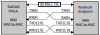
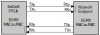

# SatCat5 Interfaces

A major goal of the SatCat5 project is to support a variety of endpoints,
from simple microcontrollers to a full-fledged PC,
all connected to the same Ethernet network.

To accomplish this, it supports a variety of media and physical-layer
options that aren't used in IEEE 802.3 Ethernet.
These options are typically lower speed (1-20 Mbps),
but use physical layer protocols that are more amenable to use with simple microcontrollers.
All interfaces transmit and receive standard Ethernet Frames.

The following is a complete listing of supported interfaces,
plus further information on how to use each option.

## Nontraditional Media

The nontraditional interfaces are IEEE 802.3 compliant, except:

* They additionally allow "runt" frames shorter than the normal minimum of 64 bytes.
* They do not use preambles or a start-of-frame token,
nor do they require an inter-packet gap.
* Jumbo frames are not supported.

Runt frames may have a payload as short as zero bytes; all other fields are required as normal.
This minimizes unnecessary per-packet overhead,
which would otherwise be costly at these relatively low bit-rates.

The switch will preserve runt frames as-is when relayed to supported interfaces.
It also zero-pads the payload field before transmission to traditional media without runt packet support.
As such, runt packets should never use the EtherType field as a length, since the length may change.
In addition, higher-layer software must be prepared for the length to change,
since packets switched over mixed networks may be zero-padded.

To provide framing information, these interfaces are SLIP encoded (IETF RFC 1055).
This provides indication of frame boundaries, and may also be used to indicate idle periods.
When transmitting, Ethernet frames should be calculated normally, including the FCS.
The entire frame is then SLIP-encoded just before transmission to the switch.

When external connectors are used, we recommend compatibility with
[Digilent's 6-pin PMOD standard](https://reference.digilentinc.com/reference/pmod/start),
which is widely supported by many embedded development platforms.
This makes it easy to buy compatible equipment, such as USB-UART adapters, from a variety of vendors.
When smaller connectors are required, we recommend any 6-pin wire-to-board connector, such as the
[Molex Pico-Lock series](https://www.molex.com/molex/products/family?key=picolock).
In such cases, the connector should be keyed and pin-order should match the PMOD specification where practical.

### I2C (2-wire)

The Inter-Integrated Circuit (I2C) bus uses two wires for bidirectional communication:

* SCL: Serial clock, primarily driven by controller (PMOD pin 3)
* SDA: Serial data, driven by both controller and peripheral (PMOD pin 4)

Both are bidirectional open-drain signals that require an external pullup resistor, typically 1 to 4 kOhm depending on application.
For more details, refer to [NXP UM10204](https://www.nxp.com/docs/en/user-guide/UM10204.pdf).
All SatCat5 I2C interfaces support clock-stretching,
but do not include collision-detection or multi-controller support.

Note that I2C has limited speed and cannot support full-duplex transfers.
It is included in SatCat5 for completeness, but SPI and UART interfaces are generally preferred.

In most cases, the SatCat5 Ethernet switch should act as the peripheral.
(i.e., The remote endpoint, typically a microcontroller, is the I2C controller and sets the baud rate.)
However, support for the opposite configuration is also provided.
In either case, the address of the peripheral can be set at build-time or through ConfigBus commands.

To transmit, the controller must execute an I2C write to the designated address, followed by any number of data bytes.
After the address, written bytes are treated as a contiguous SLIP-encoded byte stream.
I2C transactions are not used to indicate frame boundaries.

To receive, the controller must execute an I2C read to the designated address, followed by any number of data bytes.
As above, read bytes are treated as a contiguous SLIP-encoded byte stream.
Peripherals with no outgoing data should repeatedly send the SLIP inter-frame token (0xC0).

For more information on this signal naming convention, refer to
[this OSHWA resolution](https://www.oshwa.org/a-resolution-to-redefine-spi-signal-names/).

### SPI (4-wire)

The Serial Peripheral Interface uses four wires for bidirectional communication.
By convention, the "controller" is the clock-source:

* CSb: Chip-select bar, active-low, driven by endpoint (PMOD pin 1)
* COPI: Controller out / peripheral in, driven by endpoint (PMOD pin 2)
* CIPO: Controller in / peripheral out, driven by switch (PMOD pin 3)
* SCK: Serial clock, driven by endpoint (PMOD pin 4)

The Ethernet switch should usually act as the SPI clock sink and drives CIPO.
In this case, the remote endpoint (microcontroller, payload, etc.) should generate the clock and drive CSb and COPI.
However, support for the opposite configuration is also provided.

All clock-phasing modes are supported, but SPI Mode 3 is preferred.
Other modes can be set with ConfigBus commands, if the design includes this feature.
The maximum supported bit-rate depends on the internal reference clock;
refer to io_spi_clkin for details.

In SPI, transmitting and receiving data occurs simultaneously.
All exchanges are byte-aligned, and transmitted MSB-first per SPI convention.

The COPI and CIPO signals are each treated as a contiguous, SLIP-encoded byte stream.
Chip-select is not used to indicate frame boundaries.

To transmit, the endpoint should lower CSb, and strobe SCK eight times to send each byte on COPI.
Note, however, that the send/receive transactions are inseparable.
As such, the endpoint must also inspect the received bytes for SLIP-encoded frames.
If there is no data to send, the CIPO stream will simply be a repeating SLIP inter-frame token (0xC0).
Note that packets from the switch may start at any point in the CIPO stream;
they are not constrained to CSb or COPI frame boundaries.

To receive, the endpoint should simply send repeating SLIP inter-frame tokens (0xC0)
on COPI until the received stream emits two consecutive inter-frame tokens, indicating idle.
This action should be performed periodically, since there is no explicit "data-ready" indicator.

For more information on this signal naming convention, refer to
[this OSHWA resolution](https://www.oshwa.org/a-resolution-to-redefine-spi-signal-names/).

### UART (4-wire)

As the name implies, this UART interface uses four wires for bidirectional communication:

* RTSb: Request-to-send bar, active low, driven by endpoint (PMOD pin 1)
* RxD: Received data, switch to endpoint (PMOD pin 2)
* TxD: Transmit data, endpoint to switch (PMOD pin 3)
* CTSb: Clear-to-send bar, active low, driven by switch (PMOD pin 4)

Please note that naming conventions for Tx/Rx signals in this document are made with respect to the network endpoint.
In the VHDL source code, the opposite convention is used.

UART format is 1 start bit, 8 data bits, 1 stop bit, no parity.
By convention, data is always sent LSB first.
Preferred baud rate is 921,600, but other rates are supported up to ~4 Mbps.
The baud rate can be changed through ConfigBus commands.

The CTSb and RTSb lines are used for flow control.
RTSb is driven by the endpoint, and indicates that the switch is permitted to send new data.
(If the endpoint is always ready to receive new data, this signal may simply be tied to ground.)
This essentially matches the RS-232 standard when the network endpoint is the DTE and the switch is the DCE.
CTSb is driven by the switch.
It indicates that there is new data ready to be sent.
This usage does NOT match RS232 convention,
but this pin is used so that most off-the-shelf USB-UART devices can read the signal.
If this signal is not required, it may simply be ignored.

The TxD and RxD streams are SLIP-encoded to indicate frame boundaries.
Idle tokens are not required.

If flow control is not required,
then this connection type can be used for switch-to-switch connections or device-to-device connections.
Simply tie flow-control inputs to ground and cross-wire the TxD and RxD pins.

### UART (2-wire)

This variant of the UART interfaces uses only two wires for bidirectional communication:

* RxD: Received data, switch to endpoint (PMOD pin 2)
* TxD: Transmit data, endpoint to switch (PMOD pin 3)

Please note that naming conventions for Tx/Rx signals in this document are made with respect to the network endpoint.
In the VHDL source code, the opposite convention is used.

UART format is 1 start bit, 8 data bits, 1 stop bit, no parity.
By convention, data is always sent LSB first.
Preferred baud rate is 921,600, but other rates are supported up to ~4 Mbps.
The baud rate can be changed through ConfigBus commands.

Instead of RTSb/CTSb, this variant uses a query/response model for flow control.
A "query" occurs any time the endpoint sends an SLIP inter-frame character (0xC0).
Whenever this token is received, the switch will respond the next complete frame
(if one is queued), or a simple 0xC0 token to indicate that no data is available.

As with SPI, it is important to issue queries periodically to ensure data from the switch is received promptly.

### Auto-sensing

The auto-sensing port type can automatically switch between the following modes:

* SPI (as above pins 1/2/3/4)
* UART (4-wire, as above pins 1/2/3/4)
* UART (4-wire, reversed pins 4/3/2/1)

## Traditional Media

This software provides support for a number of "traditional" Media Independent Interfaces (xMII) that are intended to be fully
[IEEE 802.3-2018](https://standards.ieee.org/standard/802_3-2018.html) compliant.

In COTS devices, xMII are typically used to connect a switch or endpoint (MAC) to a physical-layer transceiver (PHY).
Various transceiver ASICs, such as the AR8031, are available to send and receive signals over twisted-pair copper, fiber, etc. over longer distances.
However, over short distances the xMII interface can be used directly, in the so-called "MAC to MAC" mode.

For legacy compatibility, these interfaces include preambles, start-of-frame tokens before each frame, and an inter-frame gap of at least 12 bytes after each frame.

Support for jumbo frames is optional, specified at build time.
If enabled, buffer sizes must be increased accordingly.

MAC-to-MAC interfaces are typically provided over a backplane;
we do not currently recommend any specific connectors or pinouts.
We may revisit this decision in the future.

### RMII

The [Reduced Media Independent Interface](http://ebook.pldworld.com/_eBook/-Telecommunications,Networks-/TCPIP/RMII/rmii_rev12.pdf) (RMII) uses 7-9 pins:

* CLK: 50 MHz reference clock (source varies).
* TXEN: Data-valid from MAC to PHY.
* TXD[1:0]: Data from MAC to PHY.
* RXEN (aka CRS_DV): Data-valid / Carrier-sense from PHY to MAC.
* RXER (optional): Error signal from PHY to MAC.
* RXD[1:0]: Data from PHY to MAC.

The interface can operate at 10 or 100 Mbps and will auto-sense the appropriate rate.

In MAC-to-MAC mode, TX* are cross-coupled to the corresponding RX* signals.
RXER is not required in this mode; tie those inputs to ground as needed.

The provided VHDL allows the clock to be sourced by an external clock,
by the endpoint, or by the switch, configurable with an FPGA rebuild.

### RGMII

The [Reduced Gigabit Media Independent Interface](https://web.archive.org/web/20160303171328/http://www.hp.com/rnd/pdfs/RGMIIv2_0_final_hp.pdf) (RGMII) uses 12 pins:

* TXCLK, TXCTL, TXD[3:0]: Clock, control, and data from MAC to PHY.
* RXCLK, RXCTL, RXD[3:0]: Clock, control, and data from PHY to MAC.

The interface can operate at 10, 100, or 1000 Mbps and will auto-sense the appropriate rate.

In MAC-to-MAC mode, TX* are cross-coupled to the corresponding RX* signals.

The RGMII standard requires a 2.0 nsec delay of the clock signal, relative to the Tx and Rx data.
Historically this has been provided by a serpentine trace on the PCB;
however this is burdensome to the hardware designer.
As such, many implementations include options to delay the clock internally,
for either transmit, receive, or both.  (This includes the SatCat5 switch FPGA.)
It is important to ensure that this delay be applied exactly once in both directions.

### SGMII

The [Serial Gigabit Media Indendent Interface](https://web.archive.org/web/20150714164353/http://www.angelfire.com/electronic2/sharads/protocols/MII_Protocols/sgmii.pdf) (SGMII) uses 4 pins.
(i.e., One differential LVDS pair in each direction.)

Each LVDS pair must be impedance-controlled (100-ohm differential) and terminated at the receiving end.
(Preferably inside the receiving device; most FPGAs provide this capability.)
Clock recovery must be performed by each LVDS receiver.
To facilitate this, allow optional AC-coupling, provide framing, and exchange link-status metadata, the signal is 8b/10b encoded.
As such, the LVDS line-rate of 1250 Mbaud supports user transfer rates up to 1000 Mbps.

The SGMII standard operates at a fixed line rate of 1250 Mbaud.
The interface can operate at 10, 100, or 1000 Mbps by repeating data tokens.
The SatCat5 switch will auto-sense the appropriate rate.

### GMII
The [Gigabit Media Independent Interface](https://web.archive.org/web/20100620164048/http://people.ee.duke.edu/~mbrooke/ece4006/spring2003/G5/802-3zStandard.pdf) (GMII) uses 24 signals, although COL and CS are not supported by the SatCat5 port. The 22 requried signals are:

* GTXCLK, TXEN, TXER, TXD[7:0]: clock, enable, error, and data from MAC to PHY.
* RXCLK, RXDV, RXER, RXD[7:0]: clock, valid, error, and data from PHY to MAC.

GMII is not widely used for MAC to PHY interfaces due to its high pin count,
but it is common between cores within FPGAs.
The SatCat5 GMII port is intended to connect third-party Ethernet IPs,
such as the Xilinx Zynq-7000 PS Ethernet MAC, to a SatCat5 switch or network.
Support for use with external GMII interfaces may be added in a future release.

# Copyright Notice

Copyright 2019, 2021 The Aerospace Corporation

This file is a part of SatCat5, licensed under CERN-OHL-W v2 or later.

You may redistribute and modify SatCat5 and make products using it under
the weakly reciprocal variant of the CERN Open Hardware License, version 2
or (at your option) any later weakly reciprocal version.

SatCat5 is distributed WITHOUT ANY EXPRESS OR IMPLIED WARRANTY, INCLUDING
OF MERCHANTABILITY, SATISFACTORY QUALITY, AND FITNESS FOR A PARTICULAR
PURPOSE. Please see (https:/cern.ch/cern-ohl) for applicable conditions.
