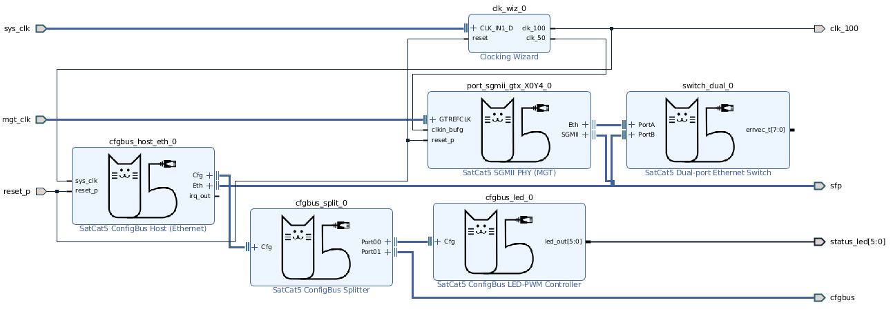
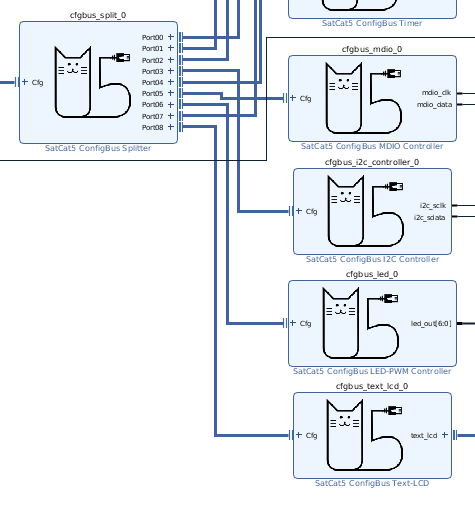

# Vivado IP Integrator Flow


For Xilinx platforms, one of the most convenient ways to use SatCat5 is through
the IP Integrator (IPI) graphical interface provided with Vivado. The vast
majority of SatCat5 modules have wrappers for the IP Integrator (block diagram)
flow, making this a recommended method to instantiate and configure SatCat5
modules.  Projects can either use the block diagram as the top-level design
or create one or more block diagram(s) instantiated as modules in a project.

## Usage

This document covers installation and configuration of the SatCat5 IP cores.
Further explanation of the Vivado IP Integrator/block diagram flow is out of scope,
as there is extensive documentation available from third-party sources on block diagram usage.

### IP Repository Setup

The Vivado IP repository is created by sourcing the
[shared_ipcores.tcl](../project/vivado/shared_ipcores.tcl) script.
This will set up the IP repository in the current project, and is typically
called directly after the
[project creation script](../project/vivado/shared_create.tcl).
This method is taken by all 'managed' example designs, such as
`arty_managed_35t` and `vc707_managed`.

Note that this script, on the first
run, will generate *all* IP cores, which number in the dozens. **Do not run
this from the Vivado GUI, create the IP cores in the Vivado batch mode**. IP
core creation in GUI mode will work, but Vivado will run all commands in the IP
Integrator graphical interface, causing IP core creation to become
excruciatingly slow on even the fastest machines. After this is done, IP blocks
will appear in the IP Catalog and can be added the same way as Vivado IP in the
block diagram (right click, 'Add IP').


More information on Vivado and IP Integrator scripts can be found in the
[README for the /project/vivado directory](../project/vivado/README.md).

One exception to this flow is the SGMII core in Multi-Gigabit Transceiver (MGT)
mode. It requires TCL arguments for the transceiver location and line rate -
unfortunately these cannot be reconfigured after IP core creation and therefore
is project-specific. Projects requiring SGMII via MGT should call the
[generate_sgmii_gtx.tcl](../project/vivado/generate_sgmii_gtx.tcl) script after
creating the rest of the IP cores. The required variables are documented in the
TCL script comments. If the script is correctly called, the project will have a
SGMII core prepared for the correct configuration, listing the reference clock
frequency and MGT location as readonly variables in the configuration.

### IP Block Configuration

SatCat5 modules in the block diagram are lightweight wrappers around their VHDL
source counterparts found throughout the [VHDL sources](../src/vhdl/).  Given
this, the IP block configuration parameters are typically one-to-one with the
generic parameters of the VHDL modules they wrap. Minimal tooltips are provided
for the configuration fields, so documentation on the fields should be looked
up in the block's corresponding VHDL source documentation. The RGMII IP block
configuration is provided as an example.


Note the usage of the native Xilinx RGMII interface and SatCat5 EthPort
interface.  These generics are defined and better documented in
[port_rgmii.vhd](../src/vhdl/common/port_rgmii.vhd):

```
-- This module implements the interface logic for an RGMII port,
-- adapting an external RGMII interface to the generic internal
...

entity port_rgmii is
    generic (
    RXCLK_ALIGN : boolean := false;     -- Enable precision clock-buffer deskew
    RXCLK_LOCAL : boolean := false;     -- Enable input clock buffer (local)
    RXCLK_GLOBL : boolean := true;      -- Enable input clock buffer (global)
    RXCLK_DELAY : real := 0.0;          -- Input clock delay, in nanoseconds (typ. 0.0 or 2.0)
    RXDAT_DELAY : real := 0.0;          -- Input data/control delay, in nanoseconds
    VCONFIG     : vernier_config := VERNIER_DISABLED);
```

Care was also taken to conform to as many of the block diagram conveniences as
possible. ConfigBus and Ethernet ports are provided as single-line interfaces
for convenience. Blocks such as the GMII PHY and AXI4 ConfigBus controller use
appropriate interface definitions from Xilinx, allowing attachment to GMII
signals provided in board support files and automatic AXI4 address space
assignment, creating base address definitions in Xilinx Vitis/SDK board support
packages (BSPs). One notable exception to this is ConfigBus device and register
addresses - the authors were unable to determine a way to add ConfigBus
addresses as a separate space within the Address Editor. **Authors must take
care to provide each block a unique ConfigBus device address**, and will need
to add corresponding definitions in software, should it exist.

## Examples

### Recommended: Multi-Port Switch with Microblaze

SatCat5 designs frequently contain a soft-core CPU, ConfigBus registers, and
switch ports. A good example design that uses the IP Integrator is the
`arty_managed_35t` design, which can be created and built using the
`make arty_managed_35t` command.


The Microblaze processor has its own hierarchical block with a relatively
standard design containing the Microblaze itself, local memory, resets,
interrupt controller, and a UART. We add a ConfigBus AXI4 host, which is
properly memory mapped using the Address Editor. The associated software for
the Microblaze can be found in its
[main.cc](../examples/arty_managed/sdk_src/main.cc).
This code uses the [SatCat5 C++ software libraries](SOFTWARE.md)
to configure the IP/UDP network stack, UART, timer, interrupts, logging, and
LEDs. More information is available in the
[software documentation](SOFTWARE.md).


At the top level of the block diagram, we can find a ConfigBus splitter,
several port types, and a multi-port switch. Note that the interface
definitions for EthPort and ConfigBus allow for single-wire connection of
these busses. A ConfigBus splitter routes control signals from the AXI4
ConfigBus host to several ConfigBus peripherals - this interface is how they
are configured by the software. There are also several devices routing to the
switch, with 2x SPI/UART ports and 1x RMII port shown. Again note the usage of
the native Xilinx RMII type for the PHY.

### Processor-Free ConfigBus Host over SGMII

Designs requiring low-to-medium throughput control and status registers may
find that ConfigBus alone meets the needs of the design. One of the simplest
of such configurations consists of a two-port switch connecting an external
Ethernet port to an internal ConfigBus host. Packets will be routed from the
external PHY (in this case SGMII) through the dual-port switch to the Ethernet
ConfigBus host. The host then drives a ConfigBus LED controller, set to device
address 0 in this case, as well as exporting the ConfigBus signals. This block
diagram exports a handful of ports and is instantiated as a module by a
separate top-level source file.



Since this block diagram is instantiated from another source file, the
ConfigBus signals will need to be properly plumbed as is described above in the
'Gotchas/ConfigBus Ports' section.

### Switch with Xilinx Tri-Mode Ethernet Mac IP

The `vc707_managed` example design provides an example design similar to the
`arty_manged_35t` design with a Microblaze and the toplevel declared by the
block diagram. One notable deviation is the use of Xilinx's Tri-Mode Ethernet
MAC (TEMAC) IP for the SFP and RJ45 gigabit Ethernet connections on the VC707
development board. This is supported, but we recommend using the SatCat5 native
[SGMII via gigabit transceiver](../src/vhdl/xilinx/port_sgmii_gtx.vhd) or
[SGMII via GPIO pin](../src/vhdl/xilinx/port_sgmii_gpio.vhd) instead. This
simply serves as an example of interfacing with third-party Ethernet IP.

Once again, we see a ConfigBus AXI4 host assigned to the Microblaze's address
space, along with a ConfigBus splitter allowing the processor to control
SatCat5 IP from software.




This design takes advantage of the
[port_stream](../src/vhdl/common/port_stream.vhd) module to interface with the
AXI Ethernet subsystem (which is a wrapper for the TEMAC core). As the TEMAC
core has its own processing for the addition and stripping of the Frame Check
Sequence (FCS), this block is configured to not expect the FCS from the
AXI-Stream ports, allowing the default TEMAC configuration to work correctly.


## Structure

If any block should require user modification or new features, it is helpful to
understand how these IP Integrator wrappers are generated. IP Integrator
scripts and VHDL can be found in the [/project/vivado](../project/vivado)
directory. [The README](../project/vivado/README.md) for that directory
contains documentation on the Vivado-specific scripts contained therein, most
of which relate to IP Integrator.

## Gotchas

### Exporting Interfaces (ConfigBus, Ports) from Block Diagram

One caveat with exporting ConfigBus and Port signals out of a block diagram and
to a top-level design is that Vivado is unable to export signals from a block
diagram as record types. Thus, a `cfgbus` signal must be converted back into
the `cfgbus_cmd` and `cfgbus_ack` record types. This can be done easily, though
some extra signals are required for `std_logic_vector` to integer conversion.
The same procedure is required for Port types, but the given example covers
only ConfigBus.

```
signal cfg_cmd          : cfgbus_cmd;
signal cfg_ack          : cfgbus_ack;
signal cmd_devaddr_slv  : std_logic_vector(7 downto 0);
signal cmd_regaddr_slv  : std_logic_vector(9 downto 0);
signal cmd_sysaddr_slv  : std_logic_vector(11 downto 0);

...

cfgbus_host_inst : entity work.cfgbus_host_wrapper
port map(
    cfgbus_clk      => cfg_cmd.clk,
    cfgbus_sysaddr  => cmd_sysaddr_slv,
    cfgbus_devaddr  => cmd_devaddr_slv,
    cfgbus_regaddr  => cmd_regaddr_slv,
    cfgbus_wdata    => cfg_cmd.wdata,
    cfgbus_wstrb    => cfg_cmd.wstrb,
    cfgbus_wrcmd    => cfg_cmd.wrcmd,
    cfgbus_rdcmd    => cfg_cmd.rdcmd,
    cfgbus_reset_p  => cfg_cmd.reset_p,
    cfgbus_rdata    => cfg_ack.rdata,
    cfgbus_rdack    => cfg_ack.rdack,
    cfgbus_rderr    => cfg_ack.rderr,
    cfgbus_irq      => cfg_ack.irq,
    ...

cfg_cmd.sysaddr <= U2I(cmd_sysaddr_slv);
cfg_cmd.devaddr <= U2I(cmd_devaddr_slv);
cfg_cmd.regaddr <= U2I(cmd_regaddr_slv);
```

The `U2I` functions for `std_logic_vector` to `integer` conversion can be found
in [common_functions.vhd](../src/vhdl/common/common_functions.vhd).

# Copyright Notice

Copyright 2022 The Aerospace Corporation

This file is a part of SatCat5, licensed under CERN-OHL-W v2 or later.

You may redistribute and modify SatCat5 and make products using it under
the weakly reciprocal variant of the CERN Open Hardware License, version 2
or (at your option) any later weakly reciprocal version.

SatCat5 is distributed WITHOUT ANY EXPRESS OR IMPLIED WARRANTY, INCLUDING
OF MERCHANTABILITY, SATISFACTORY QUALITY, AND FITNESS FOR A PARTICULAR
PURPOSE. Please see (https:/cern.ch/cern-ohl) for applicable conditions.
