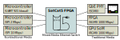

## SatCat5 Software

### What software is provided?

SatCat5 includes [C++ software libraries](../src/cpp/README.md) for:

* Sending and receiving Ethernet frames over nearly any interface.
* Sending and receiving ARP, ICMP, IP, and UDP messages.
* Configuring a managed SatCat5 Ethernet switch.
* Configuring various SatCat5 I/O peripherals (e.g., I2C, MDIO, SPI, or UART).

SatCat5 also includes [Python software libraries](../src/python) for some of these functions.

### How do I use the C++ software?

The [core functions](../src/cpp/satcat5) are as generic as possible,
designed for use on bare-metal microcontrollers, FreeRTOS, Linux, or Windows.
We provide hardware abstraction layers for several of these platforms.

Since many of these platforms are extremely constrained (64 kiB RAM or less),
the design has minimal dependencies (even printf is too large) and all objects
can be statically allocated.  Heap allocation is not used in the core, but
is an option in hardware abstraction layers intended for desktop platforms.

For more information, [refer to the README](../src/cpp/README.md).

### Why do you have a UDP network stack?

SatCat5 is intended for use on tiny microcontroller and unconventional
interfaces, like SPI and UART.  Very few operating systems allow the
required level of customization, so we built a simple stack from scratch.

SatCat5 does not currently support TCP/IP, but may add lwIP support in a future release.

# Copyright Notice

Copyright 2022 The Aerospace Corporation

This file is a part of SatCat5, licensed under CERN-OHL-W v2 or later.

You may redistribute and modify SatCat5 and make products using it under
the weakly reciprocal variant of the CERN Open Hardware License, version 2
or (at your option) any later weakly reciprocal version.

SatCat5 is distributed WITHOUT ANY EXPRESS OR IMPLIED WARRANTY, INCLUDING
OF MERCHANTABILITY, SATISFACTORY QUALITY, AND FITNESS FOR A PARTICULAR
PURPOSE. Please see (https:/cern.ch/cern-ohl) for applicable conditions.
