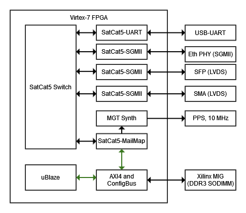
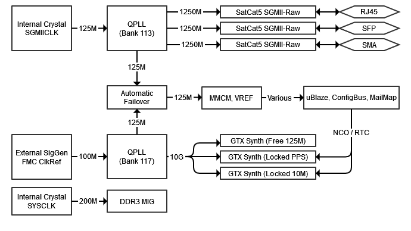

# VC707 PTP-Client Example Design

This folder contains an example design for the Xilinx VC707 development board.

The example design contains the following:
* Microblaze CPU and various peripherals.
* PTP-enabled Ethernet switch.
* PTP-enabled gigabit Ethernet ports (3x SGMII).
* PTP-enabled "MailMap" port with a software-disciplined RTC.
* (Optional) Square-wave synthesizers at various frequencies.

This design is typically instantiated back-to-back on two VC707's.
The software running on the Microblaze includes a PTP client.
The client can be configured in master or slave mode using a DIP switch.

While running, the PTP client disciplines the real-time clock (RTC) associated with the MailMap port.
(This is a virtual Ethernet NIC used in many SatCat5 designs.)
If the PTP client is operating correctly, then all connected RTCs should be synchronized.

The PTP client can connect to its counterpart through one of several SGMII interfaces.
The first connects to the VC707's Ethernet PHY.
Note that this PHY re-times the signal and may degrade PTP accuracy.
The second port connects to the VC707's SFP cage.
This allows interfacing with direct-attach cables or optical SFP modules.
If using an SFP module, please choose one that does not re-time the signal as discussed in
[White Rabbit documentation](https://ohwr.org/project/white-rabbit/wikis/SFP).
The third port connects to VC707's SMA connectors, operating in a similar fashion.

To test synchronization accuracy, the RTC output drives a set of synthesizers.
The synthesizers use MGT ports to generate phase-locked square waves at various frequencies:
1 Hz (PPS), 1 kHz, 10 MHz, and 125 MHz.
However, synthesizer operation requires a high-stability 100 MHz external clock reference
as shown in the clock-synthesis block diagram, below.
If the external reference is not provided, the rest of the system will operate.

To enable the synthesizer function, a separate FMC-to-SMA breakout card is required.
These bring various FMC signals to SMA connectors, where they can be connected to external test equipment.
Several vendors manufacture suitable cards, including:
* [IAM Electronic FMC_PINHEADER_BOARD](https://fmchub.github.io/projects/FMC_LPC_PINHEADER/Datasheet/FMC_LPC_PINHEADER_datasheet.html) (PPS only)
* [HiTechGlobal FMC_X4SMA](http://www.hitechglobal.com/FMCModules/FMC_X4SMA.htm)
    * Note: Some rework is required (install R3 and C35, then bridge TP1 to VT) for this board to accept an external clock.
* [HiTechGlobal FMC_SMA_LVDS](http://www.hitechglobal.com/FMCModules/FMC_SMA_LVDS.htm)
* [Terasic XTS-FMC](https://www.terasic.com.tw/cgi-bin/page/archive.pl?Language=English&No=1226)

The breakout card should be connected to the VC707's "FMC2" slot.
Breakout card labelling varies, so we provide the labels used on the VC707 schematic.
Synthesizer connectivity is as follows:
* FMC2_HPC_GBTCLK0_M2C_P: 100 MHz reference clock (Input, sine or square, +6 dBm typ.)
* FMC2_HPC_DP0_C2M_P: Phase-locked 1 Hz / PPS (Output)
* FMC2_HPC_DP1_C2M_P: Phase-locked 1 kHz square wave (Output)
* FMC2_HPC_DP2_C2M_P: Phase-locked 10 MHz square wave (Output)
* FMC2_HPC_DP3_C2M_P: Free-running 125 MHz square wave (Output)

# Copyright Notice

Copyright 2023 The Aerospace Corporation

This file is a part of SatCat5, licensed under CERN-OHL-W v2 or later.

You may redistribute and modify SatCat5 and make products using it under
the weakly reciprocal variant of the CERN Open Hardware License, version 2
or (at your option) any later weakly reciprocal version.

SatCat5 is distributed WITHOUT ANY EXPRESS OR IMPLIED WARRANTY, INCLUDING
OF MERCHANTABILITY, SATISFACTORY QUALITY, AND FITNESS FOR A PARTICULAR
PURPOSE. Please see (https:/cern.ch/cern-ohl) for applicable conditions.
